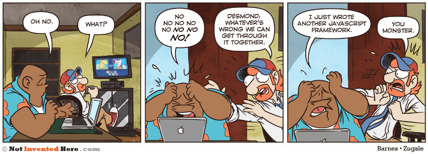

:tocdepth: 3

Frameworks
==========

Principe
++++++++

Définition du terme
---------------------

Traduction directe : structure, cadre, système, canevas

En informatique, un framework permet de fournir un cadre logiciel qui facilite la programmation du développeur d'applications.

Framework ou bibliothèque ?
---------------------------

Une *bibliothèque* implémente certains traitements complexes,
pour éviter au développeur d'avoir à le faire lui même.

Cette complexité peut-être due :

* à des aspects algorithmiques,
* au fait que les navigateurs n'offrent pas tous exactement les mêmes fonctionnalités
  (on parle d'API *cross-browser*),
* voire même ne les implémentent pas du tout
  (on parle alors de `polyfill`_).

.. _polyfill: https://en.wikipedia.org/wiki/Polyfill

.. nextslide::
   :increment:

Ex: création *robuste* d'un objet XMLHTTPRequest en Javascript "brut"

.. code::

        var request;
	try {
		request = new XMLHttpRequest();
	} catch(err1) {
		try {
			request = new ActiveXObject("Msxml2.XMLHTTP");
		} catch(err2) {
			try {
				request = new ActiveXObject("Microsoft.XMLHTTP");
			} catch(err3) {
				request = false;
			}
		}
	}

.. nextslide::
   :increment:

Création d'un objet XMLHTTPRequest en JQuery :

.. code::

    var request = $.ajax();

.. nextslide::
   :increment:

Un *framework* permet, en plus :

* de structurer le code de l'application selon une architecture particulière
  (en général `MVC`_) ;

* parfois même en rendant le langage de programmation méconnaissable
  ("style" de programmation, "idiomes" propres au framework...).

Cependant, cette différence peut être subjective, et la frontière est parfois floue.

.. note::

   En ce qui concerne la différence floue,
   JQuery est parfois considéré comme un framework,
   car il "transforme" effectivement le langage de manière assez importante
   (du code JQuery ressemble assez peu à du code Javascript classique).

.. _MVC: https://en.wikipedia.org/wiki/Model%E2%80%93view%E2%80%93controller

Frameworks Javascript (et autres)
---------------------------------

* Angular, Backbone, Ember, Knockout, React, Qooxdoo, Vue.js, Svelte
* Dojo, JQuery, Lo-Dash, Underscore, Zepto
* Frameworks spécialisés: D3, QUnit
* `Vanilla JS`_ ;-)

..
   2019-03: NB: Underscore and Zepto don't look very active recently,
   might need to remove them soon

.. _Vanilla JS: http://vanilla-js.com/

TP étude comparative de framework
---------------------------------

Pour un des frameworks de la liste précédente,
préparez une présentation de 5 minutes présentant

  + ses origines (qui l'a créé, depuis quand)
  + ses spécificités (framework ou bibliothèque),
  + ses points forts (ce qui vous pousserait à l'utiliser)
  + ses points faibles (ce qui vous découragerait de l'utiliser)

.. warning::

   Ne pas reprendre des points forts/points faibles inhérents à Javascript !! Trouvez des arguments spécifiques au framework étudié

Autres sujets possibles
-----------------------

  * Node, Phantom JS
  * CoffeeScript, TypeScript, Processing.JS
  * `ES6 <http://es6-features.org/>`_

..
	* S4-a
	 * Cours
	  + frameworks 
	* S4-b
	 * Présentations des frameworks
	 * Cours
	  + JQuery
